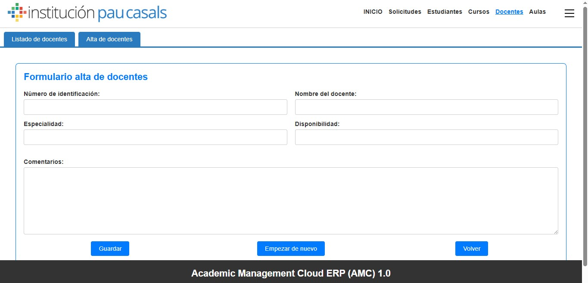
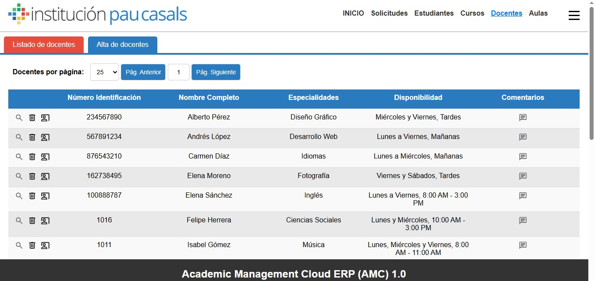
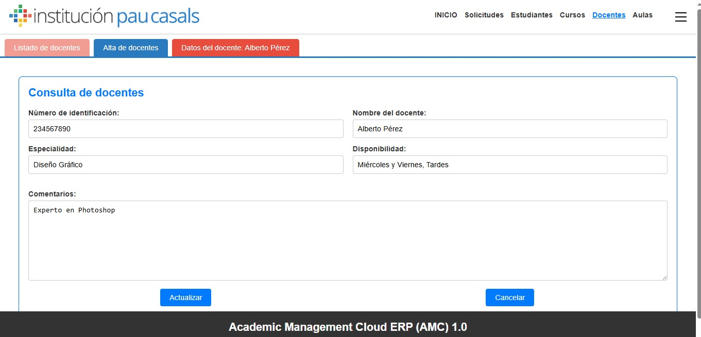

# ERP de DOCENTES - Gestión de Docentes

Este proyecto es una parte de un sistema ERP (Enterprise Resource Planning) diseñado para gestionar la información de docentes, incluyendo su alta, edición, eliminación y consulta.

---

## 🚀 Funcionalidades principales

- **Alta de docentes**: Permite registrar nuevos docentes con su número de identificación, nombre, especialidad, disponibilidad y comentarios.
- **Edición de docentes**: Permite modificar la información de los docentes existentes.
- **Eliminación de docentes**: Permite eliminar docentes de la base de datos.
- **Consulta de docentes**: Permite buscar y visualizar la información de los docentes registrados.
- **Listado de docentes**: Muestra un listado completo de todos los docentes.

---

## 🛠️ Tecnologías utilizadas

- **Frontend**: HTML, CSS, JavaScript.
- **Backend**: PHP.
- **Base de datos**: MySQL.

---

## 📂 Estructura del proyecto

El proyecto consta de los siguientes archivos principales:

- **`accesobbdd.php`**: Conexión a la base de datos.
- **`altaDocentes.php`**: Formulario para dar de alta nuevos docentes.
- **`altaDocentesApi.php`**: Lógica para procesar el alta de docentes.
- **`actualizacionDocentesApi.php`**: Lógica para actualizar la información de los docentes.
- **`borrarDocentesApi.php`**: Lógica para eliminar docentes.
- **`consultarDocentes.php`**: Formulario para consultar docentes.
- **`consultarDocentesApi.php`**: Lógica para procesar consultas de docentes.
- **`leerDocentesApi.php`**: Lógica para leer la información de los docentes.
- **`listadoDocentes.php`**: Muestra un listado de todos los docentes.
- **`listadoCursosApi.php`**: Lógica para listar los cursos asociados a los docentes.
- **`operativa_docentes.js`**: Funciones JavaScript para manejar la interacción del usuario.

---

## 🖼️ Capturas de pantalla

  
*Formulario para dar de alta nuevos docentes.*

  
*Listado de todos los docentes registrados.*

  
*Formulario para consultar la información de un docente.*
